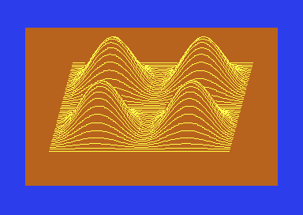

40 Grafische programma's voor de COMMODORE 64
=============================================


Leer programmeren met hoge resolutie graphics in BASIC.
-------------------------------------------------------

Marcel Sutter/Nok van Veen ISBN 90 6233 149 1




De scans van het boek staan in deze repository.
Hiermee is een PDF gemaakt, die staat  [hier op Archive.org](https://archive.org/details/40-grafische-programmas-voor-de-commodore-64)


Zelf doen
---------

Om de programma's uit te voeren, heb je een *Commodore 64* of een emulator zoals
*Vice* nodig. Voor het gemak, is er een disk image
[40_grafische_programmas_voor_de_commodore_64.d64](disk/40_grafische_programmas_voor_de_commodore_64.d64) bijgeleverd.

Deze kan je op een echte 5.25" SD/DD floppy schrijven of laden in Vice:

```shell
cd disk
x64sc -8 40_grafische_programmas_voor_de_commodore_64.d64
```

Vervolgens kan je de BASIC extensie *SIMON'S BASIC*[^simonsbasic] laden:

```c64
load "simon's basic", 8
run
```

Om een lijst van beschikbare programm's te tonen:

```c64
load "$", 8
list
```

Een programma kan vervolgens geladen en uitgevoerd worden:

```c64
load "005 diagonaalweb", 8
run
```

Voor de luie mens, kan er een wildcard gebruikt worden à la `LOAD "005*", 8`.


Aanschouw de pracht!


Ten slotte
----------

Volgens het boek komen de grafische routines uit het blad Commodore Computing (oktober 1983).

Mocht je typo's of fouten in de programmalistings ontdekken, laat het dan weten.

Met dank aan Rob Alderden voor het controleren van de scans, en het intypen van de programma's.


[^simonsbasic]: een zogenaamde *wedge* om o.a. grafische routines uit te kunnen voeren.
